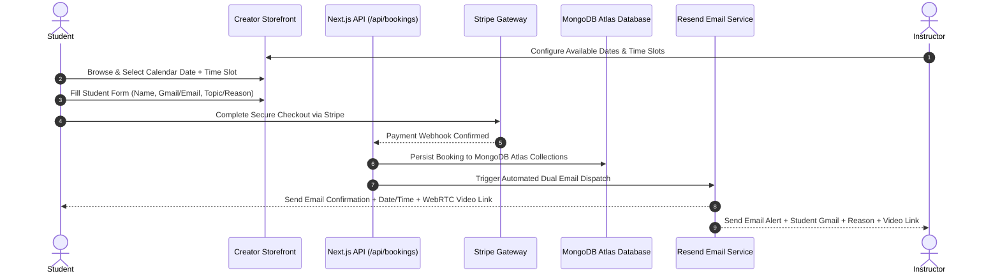

<div align="center">
  <br />
  <h1>🚀 Leap Skills</h1>
  <p><strong>Enterprise-Grade Creator Monetization & 1:1 Technical Advisory Platform</strong></p>
  <p>Book 1:1 consultations, host webinars, sell digital assets, and process instant payouts — powered by MongoDB Atlas, Stripe, and automated calendar email dispatch.</p>

  <p>
    <a href="https://leapskills.sbs"></a>
    <a href="https://nextjs.org"></a>
    <a href="https://mongodb.com"></a>
    <a href="https://stripe.com"></a>
    <a href="https://resend.com"></a>
    <a href="https://clerk.com"></a>
    <a href="https://livekit.io"></a>
  </p>
  <br />
</div>

---

## 📌 Overview

**Leap Skills** (codename: *CreatorHub Pro*) is an end-to-end creator monetization platform designed for software engineers, security architects, DevOps leaders, and technical advisors to monetize their time and expertise. 

Powered strictly by **MongoDB Atlas** for high-throughput data persistence, the platform allows instructors to set calendar availability, students to submit consultation details (Name, Gmail, Reason/Topic), process secure payments via **Stripe**, and receive automated email confirmations with auto-generated WebRTC video room links.

---

## 🔄 End-to-End System Architecture



---

## ⭐ Detailed Feature Specification

### 🍃 1. MongoDB Atlas Database Engine
- **Primary Data Persistence**: Uses MongoDB Atlas (`MONGODB_URI`) for scalable document storage and real-time query execution.
- **Connection Manager**: High-performance client connection pooling via [`src/lib/mongodb.ts`](file:///e:/mvp/src/lib/mongodb.ts) with singleton reuse across Next.js serverless route handlers.
- **Collections Architecture**:
  - `users` — Student, Instructor, and Admin accounts synced with Clerk Auth.
  - `trainer_profiles` — Public profile details, headlines, bios, hourly rates, and Stripe Connect account IDs.
  - `services` — Offerings catalog (1:1 Mentorship, Webinars, Paid DMs, Digital Products).
  - `availability_slots` — Instructor-configured date & time slots.
  - `bookings` — Confirmed student reservations, date/time timestamps, notes, and WebRTC room IDs.
  - `transactions` — Financial audit records, platform fee breakdowns, and payout statuses.

---

### 📅 2. Instructor Calendar & Date/Time Scheduling
- **Instructor Schedule Manager**: Instructors configure their custom availability and time slots (`09:00 AM`, `10:00 AM`, `11:30 AM`, `02:00 PM`, `04:00 PM`, `06:00 PM`) via [`/api/availability`](file:///e:/mvp/src/app/api/availability/route.ts).
- **Interactive Calendar Picker**: On the creator storefront ([`BookingDrawer.tsx`](file:///e:/mvp/src/components/services/BookingDrawer.tsx)), students select from available calendar dates and session durations (30m, 45m, 60m).

---

### 📝 3. Student Information & Reason Submission Form
Students complete a Zod-validated booking drawer before checkout:
- **Full Name** (`clientName`): Student's full legal or preferred display name.
- **Gmail / Email Address** (`clientEmail`): Gmail or email address where calendar confirmations and meeting credentials are sent.
- **Consultation Reason & Topic Notes** (`notes` / `dmQuestion`): Detailed question or topic requirements (e.g., Code Review, System Architecture, Career Mentorship, Security Audit).

---

### 💳 4. Stripe Checkout & Instant Connect Payouts
- **Stripe Checkout Sessions**: Secure 256-bit encrypted checkout via [`/api/payments/stripe/checkout`](file:///e:/mvp/src/app/api/payments/stripe/checkout/route.ts).
- **Automated Webhooks**: Stripe webhook listener ([`/api/payments/stripe/webhook`](file:///e:/mvp/src/app/api/payments/stripe/webhook/route.ts)) automatically updates MongoDB booking payment status to `paid`.
- **Stripe Connect Payouts**: Automated split payouts sending creator revenue directly to their connected Stripe bank accounts ([`/api/payouts`](file:///e:/mvp/src/app/api/payouts/route.ts)).

---

### ✉️ 5. Automated Dual Email Notifications (Resend API)
Integrated via [`src/lib/notifications.ts`](file:///e:/mvp/src/lib/notifications.ts):

#### 📥 Email Sent to Student (`clientEmail`):
- **Subject**: `✅ Booking Confirmed: [Service Title] with [Instructor Name]`
- **Body Details**:
  - Scheduled Date & Time (formatted with local timezone)
  - Instructor Profile & Session Overview
  - 1-Click Join Link for WebRTC Video Room ([`/meeting/[roomId]`](file:///e:/mvp/src/app/meeting/[roomId]/page.tsx))
  - Payment Receipt & MongoDB Booking ID

#### 📤 Email Sent to Instructor (`instructorEmail`):
- **Subject**: `🎉 New Booking Alert: [Student Name] booked [Service Title]`
- **Body Details**:
  - Full Student Details (Name & Gmail/Email Address)
  - Consultation Topic & Reason provided by the student
  - Scheduled Date & Time Slot
  - Direct Instructor Meeting Join URL

---

### 🎥 6. LiveKit WebRTC Video Meeting Rooms
- **Instant Room Generation**: Every confirmed booking auto-generates a secure WebRTC room ([`/meeting/[roomId]`](file:///e:/mvp/src/app/meeting/[roomId]/page.tsx)).
- **LiveKit Features**: HD video, crystal-clear audio, low-latency screen sharing, and participant controls.

---

## 🛠️ Technology Stack

| Layer | Technology |
|---|---|
| **Framework** | Next.js 15 (App Router, Server Actions) |
| **Language** | TypeScript 5 (Strict Mode) |
| **Database** | MongoDB Atlas (`mongodb` driver) |
| **Authentication** | Clerk Auth (`@clerk/nextjs`) |
| **Payments** | Stripe Connect SDK (`stripe`) |
| **Email Service** | Resend API (`resend`) |
| **Video Engine** | LiveKit WebRTC (`@livekit/components-react`, `livekit-client`) |
| **Styling** | Tailwind CSS v4, Material Symbols, Google Fonts |
| **State & Data** | Zustand v5, TanStack Query v5 |
| **Validation** | Zod (`zod`), `@hookform/resolvers` |

---

## 📁 Project Architecture & Directory Map

```
├── public/                 # Favicons, icons, static assets
├── src/
│   ├── app/                # Next.js 15 App Router Routes & APIs
│   │   ├── [username]/     # Canonical creator profile route
│   │   ├── admin/          # Platform admin & moderation dashboard
│   │   ├── api/            # REST API Routes (MongoDB backed)
│   │   │   ├── availability/ # Instructor schedule & time slot API
│   │   │   ├── bookings/   # Student booking submission & MongoDB insert
│   │   │   ├── meetings/   # LiveKit WebRTC token generator
│   │   │   ├── payments/   # Stripe checkout & webhook listener
│   │   │   └── payouts/    # Stripe Connect payout manager
│   │   ├── contact/        # Support ticket form
│   │   ├── dashboard/      # Instructor dashboard & availability setup
│   │   ├── explore/        # Creator marketplace directory
│   │   ├── meeting/        # WebRTC video room ([roomId])
│   │   ├── layout.tsx      # Root layout (ClerkProvider, QueryProvider)
│   │   ├── sitemap.ts      # Dynamic sitemap generator
│   │   └── robots.ts       # Robots.txt configuration
│   ├── components/         # React UI Components
│   │   ├── services/       # BookingDrawer, ServiceCard, InlineCheckout
│   │   ├── seo/            # Dynamic JSON-LD structured data
│   │   └── Header.tsx      # Global navigation header
│   ├── lib/                # Core Library Modules
│   │   ├── mongodb.ts      # MongoDB Atlas Database Connection Pool
│   │   ├── notifications.ts # Resend Email Service (Student & Instructor emails)
│   │   ├── websocket.ts    # Real-time WebSocket booking bus
│   │   └── api-guard.ts    # Rate limiting & security wrapper
│   └── middleware.ts       # Clerk Auth + CORS Security Middleware
├── next.config.mjs         # Production Next.js build configuration
├── package.json            # Dependencies & npm scripts
└── vercel.json             # Vercel deployment configuration
```

---

## ⚙️ Environment Variables Setup

Create a `.env.local` file in your root folder:

```env
# MongoDB Atlas Database
MONGODB_URI=mongodb+srv://<username>:<password>@cluster0.mongodb.net/leapskills

# Clerk Authentication
NEXT_PUBLIC_CLERK_PUBLISHABLE_KEY=pk_test_...
CLERK_SECRET_KEY=sk_test_...

# Stripe Payments & Connect Payouts
STRIPE_SECRET_KEY=sk_test_...
STRIPE_WEBHOOK_SECRET=whsec_...

# Resend Email Service
RESEND_API_KEY=re_...
RESEND_FROM_EMAIL="Leap Skills <noreply@leapskills.sbs>"

# LiveKit WebRTC Video Engine
NEXT_PUBLIC_LIVEKIT_URL=wss://<your-subdomain>.livekit.cloud
LIVEKIT_API_KEY=devkey
LIVEKIT_API_SECRET=secret...

# Application Base URL
NEXT_PUBLIC_APP_URL=https://leapskills.sbs
```

---

## 🚀 Installation & Local Running

```bash
# 1. Clone the repository
git clone https://github.com/arqam66/mvp_leap_skills.git
cd mvp_leap_skills

# 2. Install dependencies
npm install

# 3. Start local development server
npm run dev

# 4. Build for production
npm run build
npm start
```

---

## 📄 License

Distributed under the **MIT License**.
