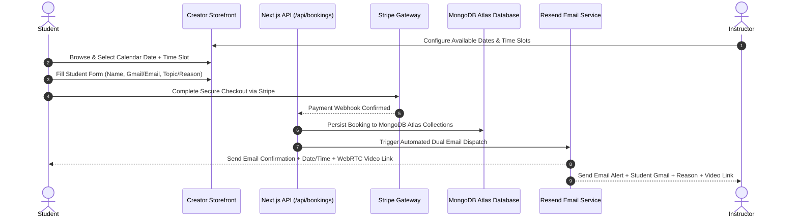

<div align="center">
  <br />
  <h1>🚀 Leap Skills</h1>
  <p><strong>Enterprise-Grade Creator Monetization & 1:1 Technical Advisory Platform</strong></p>
  <p>Book 1:1 consultations, host webinars, sell digital assets, and process instant payouts — powered by MongoDB Atlas, Stripe, and automated calendar email dispatch.</p>

  <p>
    <a href="https://leapskills.vercel.app/"></a>
    <a href="https://leapskills.sbs"></a>
    <a href="https://nextjs.org"></a>
    <a href="https://mongodb.com"></a>
    <a href="https://stripe.com"></a>
    <a href="https://resend.com"></a>
    <a href="https://clerk.com"></a>
    <a href="https://livekit.io"></a>
  </p>
  <br />
</div>

---

## 🎯 Live Deployment

| Environment | URL |
|---|---|
| **Live Demo (Vercel)** | 🔗 **https://leapskills.vercel.app/** |
| **Production (Custom Domain)** | 🔗 https://leapskills.sbs |

---

## 📌 Overview

**Leap Skills** (codename: *CreatorHub Pro*) is an end-to-end creator monetization platform designed for software engineers, security architects, DevOps leaders, and technical advisors to monetize their time and expertise.

Powered strictly by **MongoDB Atlas** for high-throughput data persistence, the platform allows instructors to set calendar availability, students to submit consultation details (Name, Gmail, Reason/Topic), process secure payments via **Stripe**, and receive automated email confirmations with auto-generated WebRTC video room links.

---

## ⚡ Feature Highlights

- **Instant Live Demo** — deployed continuously to Vercel at [leapskills.vercel.app](https://leapskills.vercel.app/).
- **Global Device Fingerprinting** — every page computes a stable FingerprintJS visitor ID, recorded silently to localStorage and console (no visible UI).
- **Premium Loading Experience** — logo-free, fullscreen retro-arcade loader with progress bar (max 3s).
- **Dark/Light Mode** — theme toggle persisted across sessions.
- **Enterprise Security** — Clerk auth, API rate limiting, CORS guard, and admin ban controls.

---

## 🔄 End-to-End System Architecture



---

## ⭐ Detailed Feature Specification

### 🍃 1. MongoDB Atlas Database Engine
- **Primary Data Persistence**: Uses MongoDB Atlas (`MONGODB_URI`) for scalable document storage and real-time query execution.
- **Connection Manager**: High-performance client connection pooling via [`src/lib/mongodb.ts`](src/lib/mongodb.ts) with singleton reuse across Next.js serverless route handlers.
- **Collections Architecture**:
  - `users` — Student, Instructor, and Admin accounts synced with Clerk Auth.
  - `trainer_profiles` — Public profile details, headlines, bios, hourly rates, and Stripe Connect account IDs.
  - `services` — Offerings catalog (1:1 Mentorship, Webinars, Paid DMs, Digital Products).
  - `availability_slots` — Instructor-configured date & time slots.
  - `bookings` — Confirmed student reservations, date/time timestamps, notes, and WebRTC room IDs.
  - `transactions` — Financial audit records, platform fee breakdowns, and payout statuses.

---

### 📅 2. Instructor Calendar & Date/Time Scheduling
- **Instructor Schedule Manager**: Instructors configure their custom availability and time slots (`09:00 AM`, `10:00 AM`, `11:30 AM`, `02:00 PM`, `04:00 PM`, `06:00 PM`) via [`/api/availability`](src/app/api/availability/route.ts).
- **Interactive Calendar Picker**: On the creator storefront ([`BookingDrawer.tsx`](src/components/services/BookingDrawer.tsx)), students select from available calendar dates and session durations (30m, 45m, 60m).
- **Live Dashboard**: Instructors manage slots, view upcoming bookings, and track earnings through [`useTrainerDashboard`](src/hooks/useTrainerDashboard.ts).

---

### 📝 3. Student Information & Reason Submission Form
Students complete a Zod-validated booking drawer before checkout:
- **Full Name** (`clientName`): Student's full legal or preferred display name.
- **Gmail / Email Address** (`clientEmail`): Gmail or email address where calendar confirmations and meeting credentials are sent.
- **Consultation Reason & Topic Notes** (`notes` / `dmQuestion`): Detailed question or topic requirements (e.g., Code Review, System Architecture, Career Mentorship, Security Audit).

---

### 💳 4. Stripe Checkout & Instant Connect Payouts
- **Stripe Checkout Sessions**: Secure encrypted checkout via [`/api/payments/stripe/checkout`](src/app/api/payments/stripe/checkout/route.ts).
- **Automated Webhooks**: Stripe webhook listener ([`/api/payments/stripe/webhook`](src/app/api/payments/stripe/webhook/route.ts)) automatically updates MongoDB booking payment status to `paid`.
- **Stripe Connect Payouts**: Automated split payouts sending creator revenue directly to their connected Stripe bank accounts ([`/api/payouts`](src/app/api/payouts/route.ts)).
- **Localized Pricing**: Prices displayed and settled in **PKR** via shared currency utilities.

---

### ✉️ 5. Automated Dual Email Notifications (Resend API)
Integrated via [`src/lib/notifications.ts`](src/lib/notifications.ts):

#### 📥 Email Sent to Student (`clientEmail`):
- **Subject**: `✅ Booking Confirmed: [Service Title] with [Instructor Name]`
- **Body Details**:
  - Scheduled Date & Time (formatted with local timezone)
  - Instructor Profile & Session Overview
  - 1-Click Join Link for WebRTC Video Room (`/meeting/[roomId]`)
  - Payment Receipt & MongoDB Booking ID

#### 📤 Email Sent to Instructor (`instructorEmail`):
- **Subject**: `🎉 New Booking Alert: [Student Name] booked [Service Title]`
- **Body Details**:
  - Full Student Details (Name & Gmail/Email Address)
  - Consultation Topic & Reason provided by the student
  - Scheduled Date & Time Slot
  - Direct Instructor Meeting Join URL

---

### 🎥 6. LiveKit WebRTC Video Meeting Rooms
- **Instant Room Generation**: Every confirmed booking auto-generates a secure WebRTC room (`/meeting/[roomId]`).
- **LiveKit Features**: HD video, crystal-clear audio, low-latency screen sharing, and participant controls.
- **Server Tokens**: Room access tokens issued via [`/api/meetings/token`](src/app/api/meetings/token/route.ts).

---

### 🆔 7. Global Device Fingerprinting (FingerprintJS)
- **Cross-Page Visitor ID**: A single `FingerprintProvider` (React context) loads FingerprintJS once and exposes a stable `visitorId` to the whole app.
- **Silent Recording**: The visitor ID is never shown in the UI — it is stored in `localStorage` (`leap_fingerprint`) and logged to the browser console on every page.
- **Zero-Bundle Bloat**: Loaded client-side only after hydration, cached and reused across route changes.

---

### 🚦 8. Enterprise Security & Access Control
- **Clerk Authentication**: Sign-up only login flow (`/login`), session middleware, and protected route guards.
- **API Rate Limiting**: Sliding-window throttling via [`src/lib/rate-limit.ts`](src/lib/rate-limit.ts) wrapping booking, payout, and availability endpoints.
- **API Guard**: Shared guard utility ([`src/lib/api-guard.ts`](src/lib/api-guard.ts)) for auth checks and error handling.
- **CORS Middleware**: Cross-origin allow-list enforced in [`src/middleware.ts`](src/middleware.ts).
- **Admin Moderation**: Admins ban/unban users through [`/api/admin/users/ban`](src/app/api/admin/users/ban/route.ts); banned users are blocked from API access via [`_lib/access.ts`](src/app/admin/_lib/access.ts).

---

### 🖥️ 9. Admin Dashboard
- Role-based protected admin area at `/admin`.
- User management with ban/unban toggles and role checks.
- Direct view into platform bookings, transactions, and creator profiles.

---

### 📡 10. Real-Time Updates
- **WebSocket Booking Bus** ([`src/lib/websocket.ts`](src/lib/websocket.ts)) pushes live booking events to connected clients.
- **Reactive UI** via Zustand v5 stores + TanStack Query v5 caching for instant state sync.

---

### ✨ 11. Premium UI / UX
- **Retro Loading Screen**: Fullscreen 8-bit style loader with percentage progress and rotating tips — no logo, max 3s.
- **Dark / Light Mode**: Theme toggle in the global header, persisted per user.
- **Modern Design System**: Tailwind CSS v4, Material Symbols, Google Fonts, animated hero sections.
- **SEO Built-In**: Dynamic JSON-LD structured data (`[username]` profiles), `sitemap.ts`, and `robots.ts`.

---

### 🎓 12. Creator Marketplace & Profiles
- `/explore` — browse the creator marketplace directory.
- `/[username]` & `/profile/[slug]` — public storefronts with services, booking drawer, and testimonial sections.
- `/dashboard` — instructor schedule, bookings, and revenue management.
- `/demo` — guided live demonstration of the platform.

---

## 🛠️ Technology Stack

| Layer | Technology |
|---|---|
| **Framework** | Next.js 15 (App Router, Server Actions) |
| **Language** | TypeScript 5 (Strict Mode) |
| **Database** | MongoDB Atlas (`mongodb` driver) |
| **Authentication** | Clerk Auth (`@clerk/nextjs`) |
| **Payments** | Stripe Connect SDK (`stripe`) |
| **Email Service** | Resend API (`resend`) |
| **Video Engine** | LiveKit WebRTC (`@livekit/components-react`, `livekit-client`) |
| **Device Fingerprinting** | FingerprintJS (`@fingerprintjs/fingerprintjs`) |
| **Styling** | Tailwind CSS v4, Material Symbols, Google Fonts |
| **State & Data** | Zustand v5, TanStack Query v5 |
| **Validation** | Zod (`zod`), `@hookform/resolvers` |
| **Testing** | Playwright (E2E) |

---

## 📦 Libraries & Dependencies

### Core Runtime

| Package | Version | Purpose |
|---|---|---|
| `next` | ^15.5.19 | React framework (App Router, API routes, middleware) |
| `react` / `react-dom` | ^19.0.1 | UI rendering |
| `typescript` | ~5.8.2 | Static type checking (Strict Mode) |

### Authentication

| Package | Version | Purpose |
|---|---|---|
| `@clerk/nextjs` | ^6.39.6 | Clerk auth for Next.js (sign-in, sessions, middleware) |
| `@clerk/types` | (transitive) | Clerk type definitions |

### Database & Backend

| Package | Version | Purpose |
|---|---|---|
| `mongodb` | ^7.5.0 | MongoDB Atlas connection & document persistence |
| `@supabase/ssr` | ^0.5.2 | Supabase client for Next.js server/browser |
| `@supabase/supabase-js` | ^2.49.1 | Supabase Postgres queries & real-time |
| `zod` | ^3.24.2 | Runtime API request validation |

### Payments & Notifications

| Package | Version | Purpose |
|---|---|---|
| `stripe` | ^17.7.0 | Stripe Checkout, Connect payouts & webhooks |
| `resend` | ^4.1.2 | Transactional email dispatch |

### Real-Time Video

| Package | Version | Purpose |
|---|---|---|
| `livekit-client` | ^2.9.3 | WebRTC meeting room client |
| `livekit-server-sdk` | ^2.11.0 | Meeting room access token generation |
| `@livekit/components-react` | ^2.8.0 | LiveKit React components (installed) |
| `@livekit/components-styles` | ^1.2.0 | LiveKit default component styles |

### State Management & Data Fetching

| Package | Version | Purpose |
|---|---|---|
| `zustand` | ^5.0.0 | Lightweight global store |
| `@tanstack/react-query` | ^5.67.2 | Server-state caching & fetching |

### UI / Styling

| Package | Version | Purpose |
|---|---|---|
| `tailwindcss` | ^4.1.14 | Utility-first styling |
| `@tailwindcss/postcss` | ^4.1.14 | Tailwind v4 PostCSS plugin |
| `tw-animate-css` | ^1.4.0 | Tailwind animation utilities |
| `clsx` | ^3.x | Conditional class names |
| `tailwind-merge` | ^3.6.0 | Tailwind class conflict merging |
| `class-variance-authority` | ^0.7.1 | Variant-driven UI component API |
| `lucide-react` | ^0.546.0 | Icon components |
| `motion` | ^12.23.24 | Declarative animations |

### Forms & Validation

| Package | Version | Purpose |
|---|---|---|
| `react-hook-form` | ^7.54.2 | Form state & validation |
| `@hookform/resolvers` | ^3.9.0 | Schema resolver bridge (zod) |

### Analytics & Device Trust

| Package | Version | Purpose |
|---|---|---|
| `@fingerprintjs/fingerprintjs` | ^5.2.0 | Global device visitor fingerprinting |

### Tooling & Testing

| Package | Version | Purpose |
|---|---|---|
| `@playwright/test` | ^1.61.1 | E2E browser testing |
| `@types/node` | ^22.14.0 | Node.js type definitions |
| `@types/react` | ^19.0.0 | React type definitions |
| `@types/react-dom` | ^19.0.0 | React DOM type definitions |
| `cross-env` | ^10.1.0 | Cross-platform environment variables |

---

## 📁 Project Architecture & Directory Map

```
├── public/                 # Favicons, icons, static assets
├── src/
│   ├── app/                # Next.js 15 App Router Routes & APIs
│   │   ├── [username]/     # Canonical creator profile route
│   │   ├── admin/          # Platform admin & moderation dashboard
│   │   │   └── _lib/       # Admin role / ban access guards
│   │   ├── api/            # REST API Routes (MongoDB backed)
│   │   │   ├── admin/users/ban/ # User ban/unban moderation API
│   │   │   ├── availability/    # Instructor schedule & time slot API
│   │   │   ├── bookings/        # Student booking submission & MongoDB insert
│   │   │   ├── meetings/        # LiveKit WebRTC token generator
│   │   │   ├── payments/        # Stripe checkout & webhook listener
│   │   │   └── payouts/         # Stripe Connect payout manager
│   │   ├── contact/        # Support ticket form
│   │   ├── dashboard/      # Instructor dashboard & availability setup
│   │   ├── explore/        # Creator marketplace directory
│   │   ├── meeting/        # WebRTC video room ([roomId])
│   │   ├── layout.tsx      # Root layout (ClerkProvider, QueryProvider)
│   │   ├── sitemap.ts      # Dynamic sitemap generator
│   │   └── robots.ts       # Robots.txt configuration
│   ├── components/         # React UI Components
│   │   ├── providers/      # FingerprintProvider (global visitor ID context)
│   │   ├── services/       # BookingDrawer, ServiceCard, InlineCheckout
│   │   ├── seo/            # Dynamic JSON-LD structured data
│   │   ├── ui/             # Loading screens, buttons
│   │   └── Header.tsx      # Global navigation header
│   ├── hooks/              # useTrainerDashboard & data hooks
│   ├── lib/                # Core Library Modules
│   │   ├── mongodb.ts      # MongoDB Atlas Database Connection Pool
│   │   ├── notifications.ts # Resend Email Service (Student & Instructor emails)
│   │   ├── websocket.ts    # Real-time WebSocket booking bus
│   │   ├── rate-limit.ts   # Sliding-window API rate limiting
│   │   └── api-guard.ts    # Auth guard & error handling wrapper
│   └── middleware.ts       # Clerk Auth + CORS Security Middleware
├── next.config.mjs         # Production Next.js build configuration
├── package.json            # Dependencies & npm scripts
└── vercel.json             # Vercel deployment configuration
```

---

## ⚙️ Environment Variables Setup

Create a `.env.local` file in your root folder:

```env
# MongoDB Atlas Database
MONGODB_URI=mongodb+srv://<username>:<password>@cluster0.mongodb.net/leapskills

# Clerk Authentication
NEXT_PUBLIC_CLERK_PUBLISHABLE_KEY=pk_test_...
CLERK_SECRET_KEY=sk_test_...

# Stripe Payments & Connect Payouts
STRIPE_SECRET_KEY=sk_test_...
STRIPE_WEBHOOK_SECRET=whsec_...

# Resend Email Service
RESEND_API_KEY=re_...
RESEND_FROM_EMAIL="Leap Skills <noreply@leapskills.sbs>"

# LiveKit WebRTC Video Engine
NEXT_PUBLIC_LIVEKIT_URL=wss://<your-subdomain>.livekit.cloud
LIVEKIT_API_KEY=devkey
LIVEKIT_API_SECRET=secret...

# Application Base URL (Vercel deployment)
NEXT_PUBLIC_APP_URL=https://leapskills.vercel.app
```

---

## 🚀 Installation & Local Running

```bash
# 1. Clone the repository
git clone https://github.com/arqam66/mvp_leap_skills.git
cd mvp_leap_skills

# 2. Install dependencies
npm install

# 3. Start local development server
npm run dev

# 4. Build for production
npm run build
npm start
```

---

## 🧪 Testing

```bash
# Run the Playwright E2E suite (starts dev server automatically)
npx playwright test
```

---

## 📄 License

Distributed under the **MIT License**.
