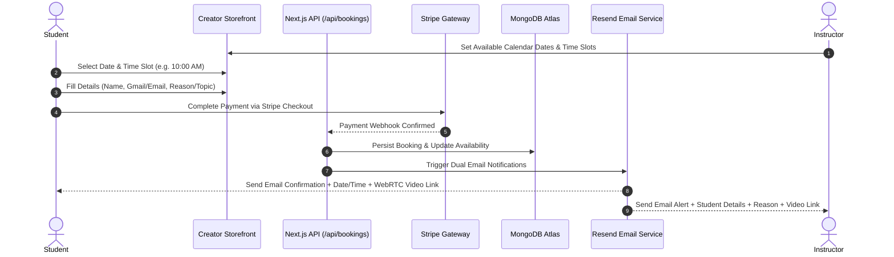

<div align="center">
  <br />
  <h1>🚀 Leap Skills</h1>
  <p><strong>Enterprise-Grade Creator Monetization & 1:1 Technical Advisory Platform</strong></p>
  <p>Book 1:1 consultations, host webinars, sell digital assets, and process instant payouts — with automated calendar scheduling and dual email confirmations.</p>

  <p>
    <a href="https://leapskills.sbs"></a>
    <a href="https://nextjs.org"></a>
    <a href="https://stripe.com"></a>
    <a href="https://resend.com"></a>
    <a href="https://clerk.com"></a>
    <a href="https://mongodb.com"></a>
  </p>
  <br />
</div>

---

## 📌 Overview

**Leap Skills** (codename: *CreatorHub Pro*) is an end-to-end platform designed for software engineers, security architects, DevOps leaders, and technical advisors to monetize their time and expertise. 

It provides an intuitive booking engine where students/clients select date & time slots configured by instructors, submit consultation context, complete payment via **Stripe**, and instantly receive automated email invitations with WebRTC video room links.

---

## 🔄 End-to-End Booking & Payment Flow



---

## ⭐ Detailed Feature Breakdown

### 📅 1. Instructor Calendar & Date/Time Slot Management
- **Instructor Availability Setup**: Instructors define their weekly availability and custom time slots (e.g., `09:00 AM`, `10:00 AM`, `11:30 AM`, `02:00 PM`, `04:00 PM`, `06:00 PM`) via the schedule manager ([`/api/availability`](file:///e:/mvp/src/app/api/availability/route.ts)).
- **Interactive Calendar Picker**: On the creator's profile page ([`BookingDrawer.tsx`](file:///e:/mvp/src/components/services/BookingDrawer.tsx)), students browse available dates and selectable time duration options (30m, 45m, 60m).

---

### 📝 2. Student Booking Details & Reason Input
When booking a consultation, students complete a streamlined details form:
- **Full Name**: Student's full legal or preferred name (`clientName`).
- **Gmail / Email Address**: Email address for automated receipt and meeting link delivery (`clientEmail`).
- **Consultation Reason / Topic**: Contextual notes detailing what the student wants to discuss (e.g., Code Review, System Architecture, Career Mentorship, Security Audit).

---

### 💳 3. Stripe Checkout & Instant Payouts
- **Stripe Checkout Sessions**: Integrated via [`/api/payments/stripe/checkout`](file:///e:/mvp/src/app/api/payments/stripe/checkout/route.ts) for secure 256-bit encrypted credit/debit card processing.
- **Stripe Webhooks**: Webhook listener ([`/api/payments/stripe/webhook`](file:///e:/mvp/src/app/api/payments/stripe/webhook/route.ts)) automatically updates booking payment status to `paid`.
- **Instant Payouts via Stripe Connect**: Automatic platform fee split and instant payouts to instructors ([`/api/payouts`](file:///e:/mvp/src/app/api/payouts/route.ts)).

---

### ✉️ 4. Automated Dual Email Dispatch (Student & Instructor)
Powered by **Resend API** ([`src/lib/notifications.ts`](file:///e:/mvp/src/lib/notifications.ts)):

#### 📥 Email to Student (`clientEmail`):
- **Subject**: `✅ Booking Confirmed: [Service Title] with [Instructor Name]`
- **Content**:
  - Exact Date & Time (formatted with local timezone)
  - Instructor Profile & Session Topic
  - Direct 1-Click Link to WebRTC Video Room ([`/meeting/[roomId]`](file:///e:/mvp/src/app/meeting/[roomId]/page.tsx))
  - Payment Receipt & Booking ID

#### 📤 Email to Instructor (`instructorEmail`):
- **Subject**: `🎉 New Booking Alert: [Student Name] booked [Service Title]`
- **Content**:
  - Full Student Details (Name & Gmail/Email)
  - Student's Topic / Consultation Reason
  - Scheduled Date & Time
  - Direct Instructor Meeting Link

---

### 🎥 5. Auto-Generated WebRTC Video Meeting Rooms
- **Instant Room Creation**: Each confirmed booking generates a unique encrypted video meeting room ([`/meeting/[roomId]`](file:///e:/mvp/src/app/meeting/[roomId]/page.tsx)).
- **LiveKit WebRTC Integration**: High-definition video, crystal-clear audio, screen sharing, and participant controls.

---

## 🛠️ Tech Stack & Architecture

| Component | Technology Used |
|---|---|
| **Framework** | Next.js 15 (App Router, Server Actions) |
| **Language** | TypeScript 5 (Strict Mode) |
| **Styling** | Tailwind CSS v4, Material Symbols, Google Fonts |
| **Authentication** | Clerk Auth (`@clerk/nextjs`) |
| **Payments** | Stripe Connect SDK (`stripe`) |
| **Email Service** | Resend API (`resend`) |
| **Database** | MongoDB Atlas (`mongodb`), Supabase SSR (`@supabase/ssr`) |
| **Video Engine** | LiveKit WebRTC (`@livekit/components-react`, `livekit-client`) |
| **State Management** | Zustand v5, TanStack Query v5 |
| **Form Validation** | Zod (`zod`), `@hookform/resolvers` |

---

## 📁 Directory Structure

```
├── public/                 # Static assets, icons, OG images
├── src/
│   ├── app/                # Next.js 15 App Router Pages & API Routes
│   │   ├── [username]/     # Canonical creator profile route
│   │   ├── admin/          # Admin management & moderation dashboard
│   │   ├── api/            # API Endpoints
│   │   │   ├── availability/ # Instructor schedule & time slot API
│   │   │   ├── bookings/   # Student booking submission API
│   │   │   ├── meetings/   # LiveKit WebRTC token generator
│   │   │   ├── payments/   # Stripe checkout & webhooks
│   │   │   └── payouts/    # Stripe Connect payout management
│   │   ├── contact/        # Support ticket form
│   │   ├── dashboard/      # Instructor dashboard & schedule manager
│   │   ├── explore/        # Marketplace directory
│   │   ├── meeting/        # WebRTC video meeting room ([roomId])
│   │   ├── layout.tsx      # Root layout (ClerkProvider, QueryProvider)
│   │   ├── sitemap.ts      # Dynamic sitemap generator
│   │   └── robots.ts       # Robots.txt configuration
│   ├── components/         # Modular React components
│   │   ├── services/       # BookingDrawer, ServiceCard, Checkout
│   │   ├── seo/            # Dynamic JSON-LD structured data
│   │   └── Header.tsx      # Global navigation header
│   ├── lib/                # Core business logic & integrations
│   │   ├── notifications.ts # Resend Email Service (Dual Email Dispatch)
│   │   ├── mongodb.ts      # MongoDB Atlas client
│   │   ├── websocket.ts    # Real-time WebSocket booking service
│   │   └── api-guard.ts    # Rate limiting & authorization wrapper
│   └── middleware.ts       # Clerk Auth + CORS Security Middleware
├── next.config.mjs         # Production Next.js build configuration
├── package.json            # Dependencies & npm scripts
└── vercel.json             # Vercel deployment metadata
```

---

## ⚙️ Environment Variables

Create a `.env.local` file in the root directory:

```env
# Clerk Authentication
NEXT_PUBLIC_CLERK_PUBLISHABLE_KEY=pk_test_...
CLERK_SECRET_KEY=sk_test_...

# Database Connection
MONGODB_URI=mongodb+srv://<username>:<password>@cluster0.mongodb.net/leapskills

# Stripe Payments & Connect Payouts
STRIPE_SECRET_KEY=sk_test_...
STRIPE_WEBHOOK_SECRET=whsec_...

# Resend Email Notifications
RESEND_API_KEY=re_...
RESEND_FROM_EMAIL="Leap Skills <noreply@leapskills.sbs>"

# LiveKit WebRTC Video Engine
NEXT_PUBLIC_LIVEKIT_URL=wss://<your-subdomain>.livekit.cloud
LIVEKIT_API_KEY=devkey
LIVEKIT_API_SECRET=secret...

# Application URL
NEXT_PUBLIC_APP_URL=https://leapskills.sbs
```

---

## 🚀 Getting Started

### 1. Installation

```bash
git clone https://github.com/arqam66/mvp_leap_skills.git
cd mvp_leap_skills
npm install
```

### 2. Development

```bash
npm run dev
```
Open [http://localhost:3000](http://localhost:3000) in your browser.

### 3. Production Build

```bash
npm run build
npm start
```

---

## 🔒 Security & Best Practices

- **Sanitization & Zod Validation**: Strict runtime schema validation for student inputs (Name, Email, Reason/Notes).
- **Per-IP Rate Limiting**: Protection against spam booking requests ([`src/lib/rate-limit.ts`](file:///e:/mvp/src/lib/rate-limit.ts)).
- **CORS Allowlist**: Secure API route middleware with preflight handling ([`src/middleware.ts`](file:///e:/mvp/src/middleware.ts)).

---

## 📄 License

Distributed under the **MIT License**.
